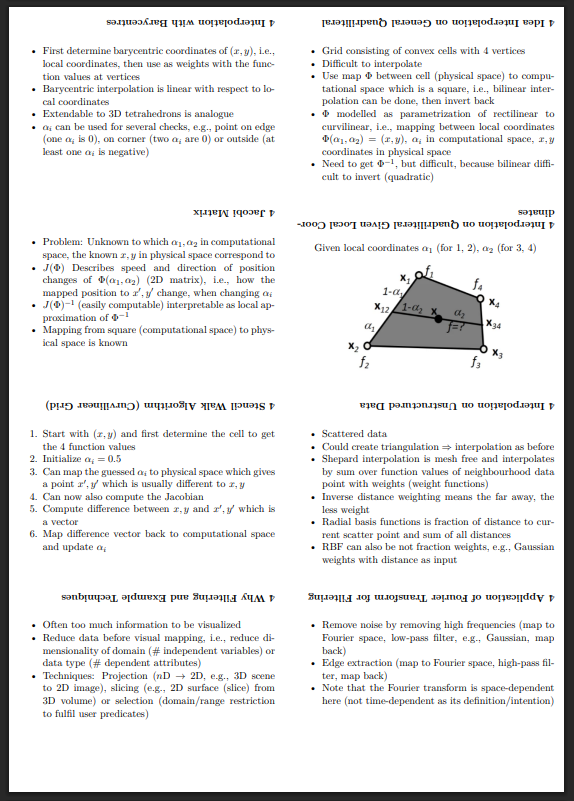

# LaTeX Keycards
This LaTeX template implements the following requirements:
- Create keycards to learn for any topic
- All keycards stored in a single PDF file, e.g., enables searching for things with `Ctrl + F`
- Keycards printable to be used to learn without any digital screens

The main command is `\keycard{title}{content}` which evaluates to an 1/8 block of the page (0.5 width, 0.25 height), i.e., 8 keycards per page.
The title is the string used for learning by seeing it and guessing the corresponding content.
The content can be any LaTeX, math, itemize etc.
Note that the fix sizes should encourage to create small keycards.
In case there is a need for a bigger keycard, use `\longkeycard{title}{content}` which works the same way, but uses the whole textwidth and dynamic height.
Furthermore, there is a flag argument in the settings to change between the digital version and the version to print.
The main difference is that the titles are rotated by 180° which allows bending the title to the back of the printed, cut out cards for learning.

Finally, at the end the total number of key cards is displayed.

### Usage
1. Download the repository content and follow the instructions in `main.tex`
1. Print the PDF as A4 format without double page printing (**don't forget to set the rotate flag before producing the PDF to print!**)
1. Cut out the keycards with scissors
1. Glue long keycards over multiple pages together, if needed
1. Bend the title part of each keycard to the back and glue it
1. Start learning

### Examples
One page of an example PDF for the final version to print is depicted in the following figure.

An example for the digital version PDF is [here](examples/example-digital-version.pdf).
The corresponding version to print, cut and learn with looks like can be seen [here](examples/example-print-version.pdf).
